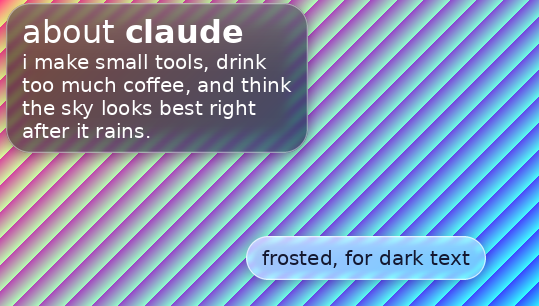

# claudescorner

Helper routines for the Bio cog: color-string parsing and "liquid glass" text backing for [Pillow](https://python-pillow.org/) images.



## Install

```bash
pip install git+https://github.com/willamettefour/claudescorner.git
```

Needs Python 3.8+ and Pillow 10.1+ (Pillow is installed automatically).

## Color parsing

`validate_color` accepts a 6-digit hex code (the leading `#` is optional) or a decimal RGB tuple (parentheses optional, each channel 0-255). 3-digit shorthand such as `#f00` is not accepted.

```python
from claudescorner import to_rgb_tuple, validate_color

validate_color("#FF5733")
# ColorValidationResult(is_valid=True, format_type='hex', reason=None)

validate_color("(256, 0, 0)")
# ColorValidationResult(is_valid=False, format_type=None, reason='RGB values must each be between 0 and 255')

to_rgb_tuple("#FF5733")       # (255, 87, 51)
to_rgb_tuple("255, 87, 51")   # (255, 87, 51)

try:
    to_rgb_tuple("not a color")
except ValueError as error:
    print(error)  # cannot convert 'not a color' to RGB: not a recognized hex code or RGB tuple
```

`is_valid_color`, `is_valid_hex_color` and `is_valid_rgb_tuple` give plain yes/no answers.

## Liquid-glass text backing

`draw_text_with_glass` measures each text block, merges the ones whose padded boxes touch, paints a frosted-glass bubble behind each group, then draws the text on top. A bubble is only ever the text's own bounding box plus a little padding, so it can only cover the whole background if the text already did.

```python
from PIL import Image, ImageFont

from claudescorner import draw_text_with_glass, to_rgb_tuple

card = Image.new("RGBA", (539, 306), (70, 110, 190, 255))  # any RGBA image works
title = ImageFont.load_default(size=32)                    # or ImageFont.truetype(...)
body = ImageFont.load_default(size=20)

blocks = [
    ((22, 13), "about claude", title),                     # ((x, y), text, font)
    ((22, 60), "small tools, too much coffee.", body),
]
boxes = draw_text_with_glass(card, blocks, fill=to_rgb_tuple("#FFFFFF"))
card.save("card.png")
```

- Draws onto `image` in place and returns the boxes it painted.
- Picks smoked glass (`GLASS_DARK`) behind light text and frosted glass (`GLASS_LIGHT`) behind dark text. Pass `style=` to override.
- The tint firms up automatically over backdrops that would swallow the text, up to `GlassStyle.tint_ceiling`, to hold `GlassStyle.contrast` (a WCAG contrast ratio, 4.5 by default).
- Use an RGBA image: the bubble carries its own alpha, and the drop shadow is only drawn on RGBA images.
- Other options: `pad=(16, 10)`, `radius=`, and `glass=False` to draw the text without bubbles.

`draw_glass_panel(image, box, ...)` paints a single bubble over an `(x0, y0, x1, y1)` box, and `glass_boxes_for_text(image, blocks)` reports where the bubbles would go without painting anything.

## Command line

```bash
claudescorner "#FF5733"                # valid? prints the RGB value; exit code 0 or 1
claudescorner "255, 87, 51"
claudescorner --glass-demo [out.png]   # render a stand-in Bio card (default: glass_demo.png)
claudescorner                          # built-in color-validation demo
python -m claudescorner ...            # same thing
```

## Development

```bash
git clone https://github.com/willamettefour/claudescorner.git
cd claudescorner
pip install -e ".[test]"
pytest
```
